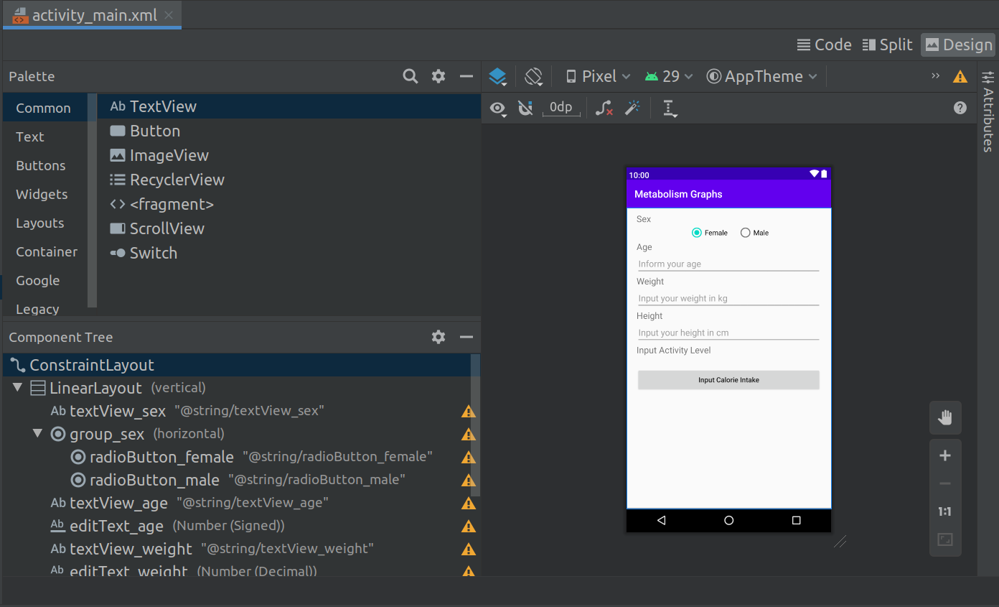

This is a sample Android application developed in Java and using the Google Chart API. The app helps monitor the calories intake for each meal. The Chart API helps displaying the pizza and bar graphs with the daily calories intake and recommended intake depending on factors like age, weight, height, sex and physical activity level.

